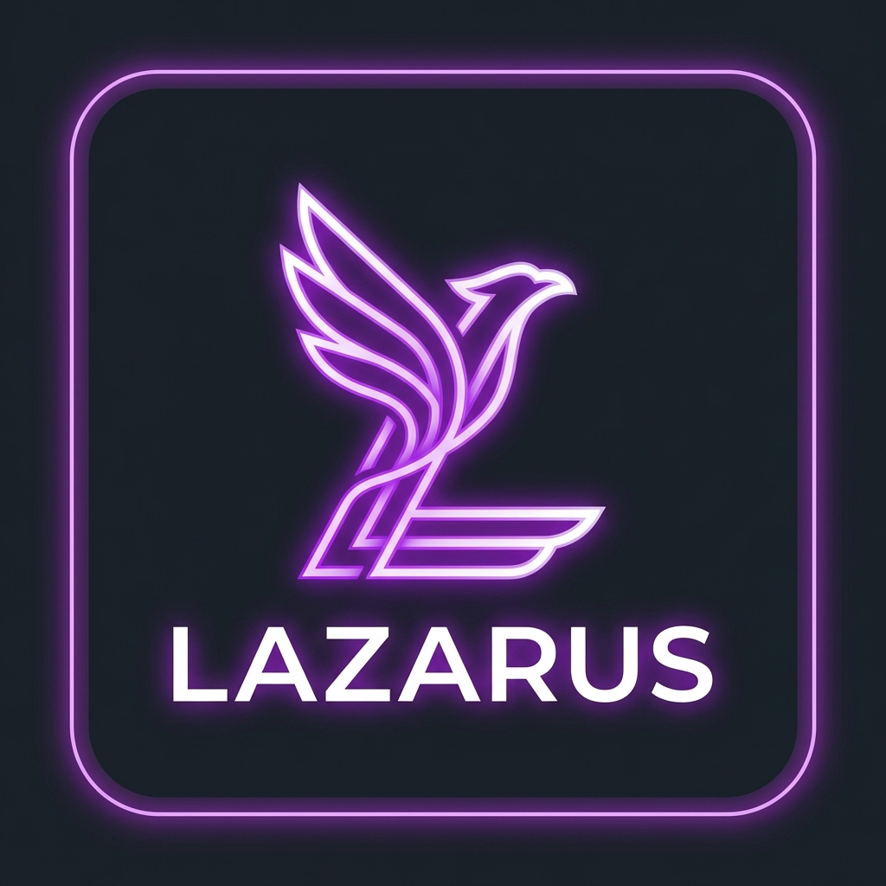
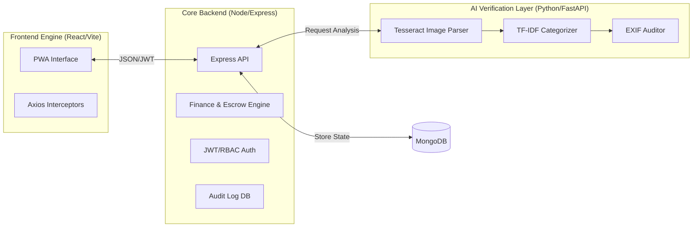

<div align="center">
  
  <h1>LAZARUS : THE TRUST PROTOCOL</h1>
  <p><strong>A Transparent, AI-Verified Creator Funding Ecosystem</strong></p>

  [](https://react.dev/)
  [](https://nodejs.org/)
  [](https://fastapi.tiangolo.com/)
  [](https://www.mongodb.com/)
</div>

---

## 📖 Introduction
Lazarus is not just a crowdfunding platform; it is a **Trust Protocol**. In an era where creator funding is plagued by a lack of transparency and misappropriation of funds, Lazarus provides a self-governing ecosystem. Using a unique blend of **AI-driven expense auditing**, **milestone-based capital release**, and **weighted governance**, we ensure that every rupee contributed by a backer is utilized exactly as promised.

### 🔴 The Problem 
Creators raise massive amounts but lacks accountability. Backers have zero visibility into where their money goes after the "Success" email arrives.

### 🟢 The Lazarus Solution
An "Atomic Escrow" system where funds are locked and only released when the community (or AI) verifies progress via physical and digital evidence.

---

## 🚀 Core Platform Features

### 1. 🛡️ Atomic Escrow & Milestone Tranches
- **Fund Locking**: Contributions are held in a project-specific virtual vault, not directly given to the creator.
- **Progress-Based Payouts**: Creators set milestones (e.g., Scripting, Production, Final Edit). Only when a milestone is verified is a percentage (tranche) of the funds released to the creator's personal wallet.
- **Kill-Switch (Refund Engine)**: If a project fails to meet its "Seed Goal" by the deadline, the system triggers an automatic, atomic refund to all backers.

### 2. 🤖 AI Multi-Stage Verification (AI Service)
- **Neural OCR**: Uses Tesseract to scan receipts for vendor names, price mismatches, and dates.
- **Fraud Audit**: Checks image EXIF metadata to ensure receipts aren't recycled or digitally manipulated.
- **Rule Engine**: Validates every expense against project-specific rules (e.g., "Cannot spend more than 20% on Marketing").

### 3. ⚖️ Weighted Governance & Voting
- **Contribution Power**: Your "Voting Weight" is proportional to your investment.
- **Deadline Extensions**: Creators must propose a governance request to extend deadlines, which backers must approve via consensus.
- **Milestone Approval**: Backers view multimedia proof (videos/PDFs) and vote to release the next tranche of funding.

### 4. 💹 Automated Yield & Revenue Distribution
- **Profit Sharing**: Creators can ingest project revenue (off-chain sales/ad-sense).
- **Auto-Distribution**: The system automatically calculates and pours dividends back into backers' wallets based on their ownership percentage.

---

## 🏗️ Technical Architecture



---

## � Multi-Repo Structure Analysis

### [📁 Frontend](file:///c:/Users/Omkar%20Raut/OneDrive/Desktop/TSEC_Hacks_26/frontend)
- **`src/context`**: Managed via `AuthContext` for persistent sessions and `ThemeContext` for the dark/neon aesthetic.
- **`src/pages`**: Contains the complex `CampaignDetails` which acts as the "War Room" for investors and creators.
- **`src/utils/api.js`**: Centralized Axios instance with automatic token injection.

### [📁 Backend](file:///c:/Users/Omkar%20Raut/OneDrive/Desktop/TSEC_Hacks_26/backend)
- **`src/services`**: The heart of the app.
  - `financeService.js`: Handles the high-stakes logic of atomic tranches and refunds.
  - `expenseService.js`: Conducts multi-point validation on every bill submission.
- **`src/models`**: Defined schemas for `AuditLog`, `Project`, `Wallet`, and `GovernanceRequest`.

### [📁 AI Service](file:///c:/Users/Omkar%20Raut/OneDrive/Desktop/TSEC_HACKS_26/ai_service)
- **`main.py`**: A specialized FastAPI service that takes image buffers and returns "Risk Scores" and "Confidence Levels" to the main backend.

---

## ⚙️ Installation & Developer Guide

### 1. Prerequisites
- **Node.js 18+** & **npm**
- **Python 3.10+** (with pip)
- **Tesseract OCR** (System-level installation required)
- **MongoDB Atlas** account for database.

### 2. Environment Configuration

#### Backend (`/backend/.env`)
```env
PORT=3000
MONGO_URI=mongodb+srv://...
JWT_SECRET=your_jwt_key
GROQ_API_KEY=gsk_...
CLOUDINARY_CLOUD_NAME=...
CLOUDINARY_API_KEY=...
CLOUDINARY_API_SECRET=...
```

#### Frontend (`/frontend/.env`)
```env
VITE_API_BASE_URL=http://localhost:3000/api
```

### 3. Quick Start Commands

| Layer | Path | Command |
| :--- | :--- | :--- |
| **Backend** | `./backend` | `npm install && npm start` |
| **Frontend** | `./frontend` | `npm install && npm run dev` |
| **AI Service**| `./ai_service`| `pip install -r requirements.txt && uvicorn main:app --reload` |

---

## 👥 Meet the Architects

| Member | Focus | GitHub |
| :--- | :--- | :--- |
| **Aryan Salunke** | AI Services & OCR Pipelines | [@AryanSalunke987](https://github.com/AryanSalunke987) |
| **Kushagra Mehta** | UI/UX & Interaction Design | [@kushagra819](https://github.com/kushagra819) |
| **Advait Nair** | Backend & API Integration | [@AdvaitNair0806](https://github.com/AdvaitNair0806) |
| **Omkar Raut** | Backend & Frontend Integration | [@omkar454](https://github.com/omkar454) |

---

##  Final Note for Hackathon Evaluators
Lazarus was built for **TSEC Hacks 2026** as a prototype for a more accountable internet. The system utilizes "Virtual Financial Nets" to ensure user safety and creator freedom simultaneously.

---
<div align="center">
  <sub>Developed with ❤️ by Team Lazarus.</sub>
</div>
